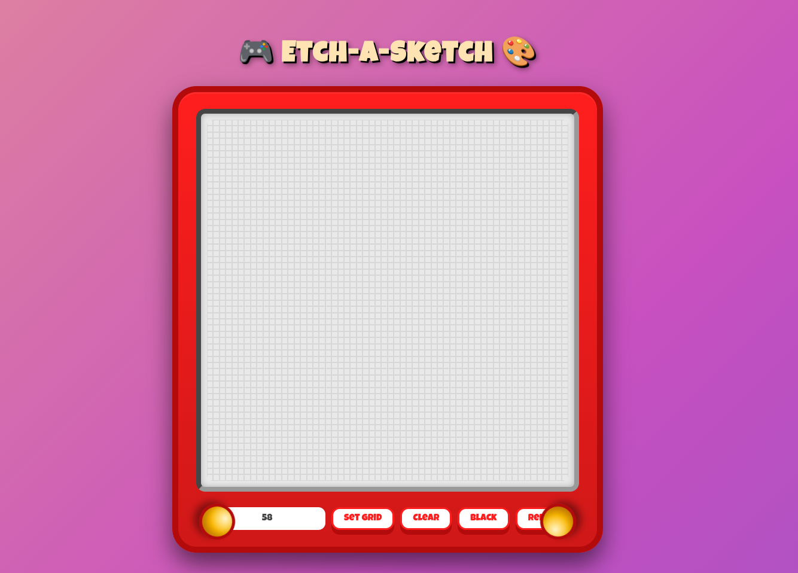

# 🎮 Etch-A-Sketch

> _A playful digital remake of the classic Etch-A-Sketch toy — draw, erase, and shake to clear!_



---

### ✨ Features

🧩 **Dynamic Grid System** – Resize your grid to any size from `1×1` to `100×100`  
🎨 **Color Modes** – Switch between Black and Red “ink” instantly  
🧹 **Shake-to-Clear Animation** – Just like the real toy! The screen shakes before clearing  
🕹️ **Cartoonish UI** – A retro GameBoy-style design with knobs and soft shadows  
⚡ **Responsive Layout** – Works beautifully on desktops and tablets  
💡 **Simple, Clean Code** – Built only with HTML, CSS & Vanilla JS — no frameworks!  

---

### 🧠 Project Overview

This project recreates the nostalgic experience of an **Etch-A-Sketch** in the browser.

You can “draw” by hovering your cursor over a grid of pixels, choose your color, and even shake the screen to erase your masterpiece. The grid dynamically resizes to any value you choose, so you can go from 16×16 to 64×64 or beyond!

---

### 🧰 Tech Stack

| Front-End | Purpose |
|------------|----------|
| **HTML5** | Structure of the app |
| **CSS3 (Flexbox & Animations)** | Styling and layout |
| **JavaScript (Vanilla)** | Grid generation and interactivity |

---

### 🚀 Getting Started

**Clone the repository:**
```bash
git clone https://github.com/shauryamohan20/Etch-A-Sketch.git
```

Open it locally:
```bash
Copy code
cd etch-a-sketch
Run the project:
Just open the index.html file in your browser.
```
⚙️ How It Works
On page load, a 16×16 grid is generated.

Each pixel (div) listens for a mouseenter event.

Color buttons update a global activeColor variable.

The Clear button triggers a “shake” animation on the Etch-A-Sketch frame before clearing all colors.

Changing the grid size rebuilds the grid dynamically.

🧑‍💻 File Structure
```bash
Copy code
etch-a-sketch/
│
├── index.html        # HTML structure
├── app.css           # Styles & animations
├── demo.js           # Grid logic & interactions
└── screenshot.png    # Screenshot of the project
```
🏗️ Future Improvements
🧠 Add rainbow / random color mode

🖱️ Enable click-and-drag painting

📱 Improve mobile touch support

💾 Add “Save Drawing” as an image feature

💖 Acknowledgments
Built with nostalgia, caffeine, and lots of love ❤️
Inspired by the classic Etch-A-Sketch toy we all grew up with.

📜 License
This project is open-source under the MIT License.
Feel free to remix, modify, and share!
